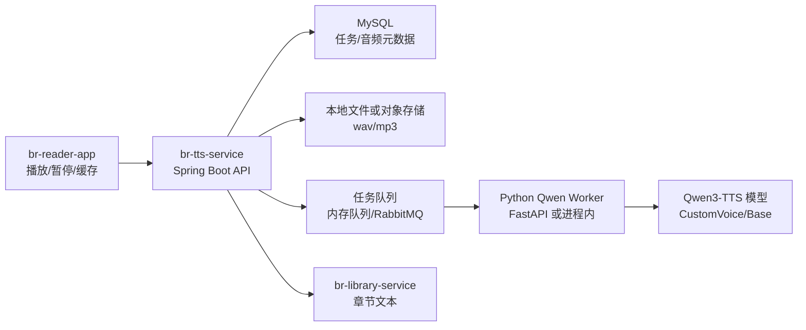

# br-tts-service 计划:把朗读做成独立 MVP

> **结论先行**:朗读应该做成独立 `br-tts-service`,不是直接塞进 App,也不是塞进现有 AI 服务。Spring Boot 负责平台 API、任务、缓存和权限;Python Worker 负责 Qwen3-TTS 推理。这样既能接入 BookRealm,也能复用给其他项目。

## 一、已有资产

本地 `C:\Users\艾莉\知识数据库\tts pre` 已经不是空白项目,它有:

- `ttslib/`:可复用 TTS 核心包;
- `server.py`:FastAPI HTTP 服务,模型常驻;
- `Qwen3-TTS-12Hz-0.6B-CustomVoice`:9 个预设音色;
- `Qwen3-TTS-12Hz-0.6B-Base`:VoiceClone;
- `dub.py`:整段/SRT 配音与对齐;
- `/tts`、`/clone`、`/health`、`/voices` 接口;
- 一把锁串行推理,单机 MVP 可用。

问题也很明确:它现在是工具箱,不是平台服务。BookRealm 需要任务、缓存、鉴权、章节切分、音频文件管理和 App 播放协议。

## 二、为什么不用 App 本地 TTS 一把梭

**结论:本地 TTS 适合 v2.3 的保底播放,服务端 TTS 适合高质量朗读。两者应该共存。**

| 方案 | 优点 | 缺点 | BookRealm 用法 |
| --- | --- | --- | --- |
| Android 系统 TTS | 稳、快、离线、容易接通知栏 | 音质和情绪一般,不同手机差异大 | 第一阶段保底 |
| Qwen3-TTS 服务端 | 音质更可控,可统一音色,可缓存音频 | 推理慢,吃资源,需要任务队列 | 高质量章节朗读 |
| VoiceClone | 有个性化声线 | 版权/授权/质量评估复杂 | 实验功能,不默认开放 |

所以 v2.3 应该先让 App 能听;v2.4/v2.5 再让服务器稳定生成高质量音频。

## 三、推荐架构

### Spring Boot 层负责

- `POST /api/tts/jobs`:创建朗读任务;
- `GET /api/tts/jobs/{id}`:查询任务状态;
- `GET /api/tts/audio/{id}`:播放音频;
- `GET /api/tts/voices`:返回可用音色;
- 文本切分、任务去重、缓存命中;
- 鉴权、限流、失败重试;
- 把生成记录写入数据库。

### Python Worker 负责

- 加载 Qwen3-TTS 模型;
- 执行单段或多段合成;
- 返回 wav/mp3 文件路径和时长;
- 保持模型常驻,避免每次 25 秒加载。

## 四、并发策略

**结论:不要一开始追“多线程满血并发”,先做可控队列。**

Qwen3-TTS 推理本身很重,盲目多线程容易把内存和 CPU 打满。v1 Worker 一把锁串行是合理的;平台层要做的是排队和缓存。

推荐三阶段:

| 阶段 | 策略 | 完成定义 |
| --- | --- | --- |
| TTS-1 | 单 Worker 串行 + 任务队列 | 多人提交不会崩,任务能排队 |
| TTS-2 | N 个 Worker 进程 | 按机器资源配置并发数 |
| TTS-3 | RabbitMQ 分发 + Worker 池 | 可横向扩展到多机器 |

第一版不要直接让 App 等同步响应。App 应该提交任务,轮询状态或收到完成后播放。

## 五、数据模型

| 表 | 关键字段 |
| --- | --- |
| tts_voice | id, name, lang, engine, description, enabled |
| tts_job | id, userId, bookId, chapterId, textHash, voiceId, status, errorMessage |
| tts_segment | id, jobId, paragraphIndex, text, audioPath, durationMs, status |
| tts_audio_cache | textHash, voiceId, audioPath, durationMs, createdAt |

缓存关键是 `textHash + voiceId + engineConfig`。同一段文本同一音色生成过,后面直接复用。

## 六、App 侧体验

**结论:App 里不要让用户理解“任务系统”,用户只应该看见播放。**

阅读页需要:

- 朗读按钮;
- 播放/暂停/停止;
- 当前段落高亮;
- 语速、音色选择;
- 后台通知栏播放控制;
- 本地 TTS / 高质量 TTS 切换;
- 服务端音频生成中时显示“正在准备朗读”。

第一版可以这样裁剪:

- 本地 TTS 立即播;
- 服务端 TTS 点击后生成当前章节;
- 生成完成后缓存播放;
- 没生成完时不阻塞阅读。

## 七、迁移步骤

**结论:不要直接重写掉 `tts pre`;先把它封装成 Worker,再新建 Spring 服务。**

1. 冻结 `tts pre` 为参考资产,不要继续无结构改;
2. 新建 `br-tts-service` 仓库;
3. Spring Boot 建立 job/voice/audio API;
4. 先用 HTTP 调 `tts pre/server.py`;
5. 跑通当前章节生成 wav;
6. 增加音频文件存储和缓存;
7. App 阅读页接入服务端朗读;
8. 再考虑把 Python Worker 代码复制进 `br-tts-service/worker`。

## 八、v2 裁决

**结论:v2.1 先做阅读体验,v2.3 再做 TTS,但现在可以开始设计 `br-tts-service`。**

原因:

- 阅读器没做好,朗读入口没有承载面;
- TTS 是重服务,需要单独排期;
- 已有 Python 资产足够好,不需要推倒重来;
- Spring 架构的价值在任务和集成,不是替代模型推理。
