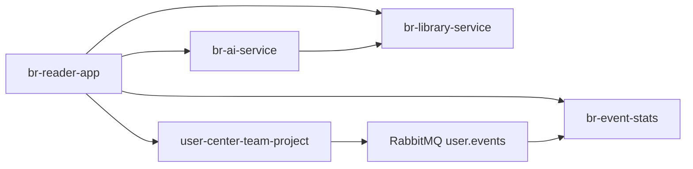

# 仓库地图:BookRealm 由哪些模块组成

> **结论先行**:本页保留旧链接兼容。当前正本是 [仓库与能力地图](/architecture/repositories);BookRealm 是一个产品,下列仓库是可独立构建的能力组件,不是多个 MVP。

## 平台结构

```
book-realm                 平台书 + 需求/架构/技术图鉴 + 集成说明
 ├── user-center-team-project   用户中心:注册、登录、JWT、登录事件
 ├── br-library-service         书库服务:公版书内容 API
 ├── br-reader-app              Android 阅读 App:书城、书架、阅读器、AI 入口
 ├── br-event-stats             事件统计:登录事件消费、阅读进度统计
 └── br-ai-service              AI 阅读助手:摘要、embed、RAG 原文问答
```

## 各仓登记表

| 模块 | 仓库 | 能独立做什么 | 平台内负责什么 | 状态 |
| --- | --- | --- | --- | --- |
| 平台书 | [book-realm](https://github.com/wohuishuo/book-realm) | 读完整工程书,理解平台需求、架构、技术栈和集成顺序 | 总设计与总文档 | ✅ |
| 用户中心 | [user-center-team-project](https://github.com/wohuishuo/user-center-team-project) | 作为任意项目的认证服务复用 | App 登录、JWT、登录事件源 | ✅ |
| 书库服务 | [br-library-service](https://github.com/wohuishuo/br-library-service) | 给任意阅读器或 RAG 项目提供书/章/段接口 | 内容底座 | ✅ |
| 阅读 App | [br-reader-app](https://github.com/wohuishuo/br-reader-app) | 作为 Compose 阅读客户端学习样例 | 用户真实入口 | ✅ |
| 事件统计 | [br-event-stats](https://github.com/wohuishuo/br-event-stats) | 学 RabbitMQ 事件消费和统计聚合 | 登录统计、阅读进度统计 | ✅ |
| AI 服务 | [br-ai-service](https://github.com/wohuishuo/br-ai-service) | 学 DeepSeek 接入和 RAG 原文问答 | 摘要、问答、引用依据 | ✅ |

## 调用关系



**关键裁决**:App 不直连 RabbitMQ。移动端只走 HTTP;RabbitMQ 只用于后端服务之间的异步事件。

## 为什么分仓

**结论:分仓不是为了显得复杂,而是为了让边界真实可见。**

用户中心可以服务别的 App;书库服务可以被别的阅读器或 AI 项目复用;事件统计可以替换成更复杂的数据平台;AI 服务可以换模型、换向量库。每一块独立,整个平台才不会变成一团难以讲清的代码。
