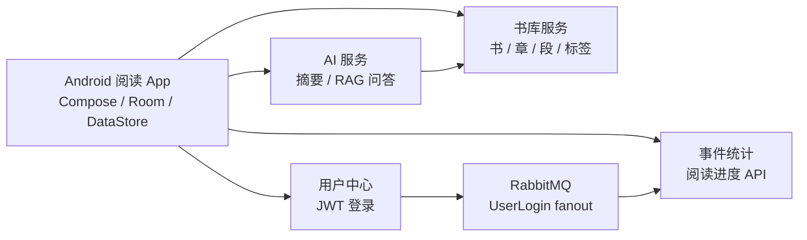

## 一分钟理解

**结论:BookRealm 是一个已经跑通 v1 主链路的 AI 辅助阅读平台,也是一份可继续执行的产品 PRD。**

读者在 Android App 登录后,可以搜索公版书、加入书架、打开章节阅读;系统会记录登录和阅读进度;读到不懂的段落时,可以请求摘要或提问,AI 会先检索书中原文,再生成带依据的回答。

如果只想知道“这个产品要做什么、做到哪、怎么验收”,先读 [产品 PRD](/platform/prd)。如果想知道“为什么这样设计”,再读平台篇 P1-P8 和工程治理文档。

## 平台长什么样

**结论:一个 Android 客户端 + 四个后端服务,各自独立,组合成完整阅读体验。**

每个服务仓库都能独立运行。平台书负责把这些模块的边界、接口、依赖和生命周期讲清楚。

## 三条阅读线

| 你现在想做什么 | 建议路径 |
| --- | --- |
| **先跑起来** | 读 [实战篇](/project/),按用户中心 → 书库 → App → 统计 → AI 顺序走 |
| **先判断产品** | 读 [产品 PRD](/platform/prd),看用户、范围、功能、验收和风险 |
| **先想清楚** | 读 [平台设计证据](/platform/),看 P1-P8、架构治理和技术裁决 |
| **先补技术** | 读 [技术图鉴](/stack/),每个依赖一张卡,先知道它解决什么问题 |

> 这本书遵守同一条写作规则:先给结论,再给根据和例子。读者不用陪作者绕路,应该直接走到结果。
